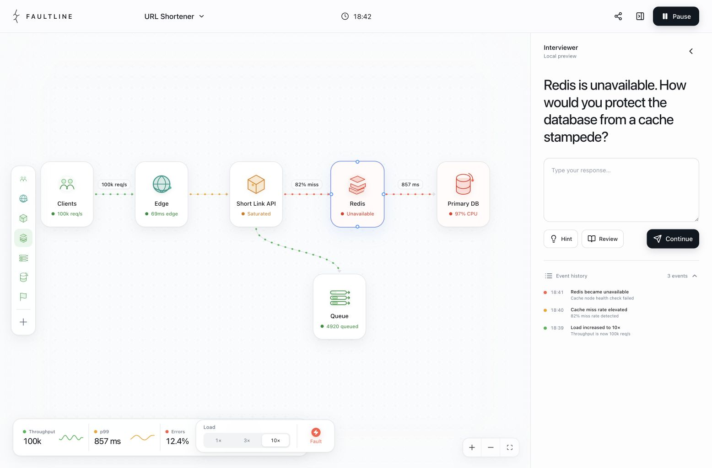
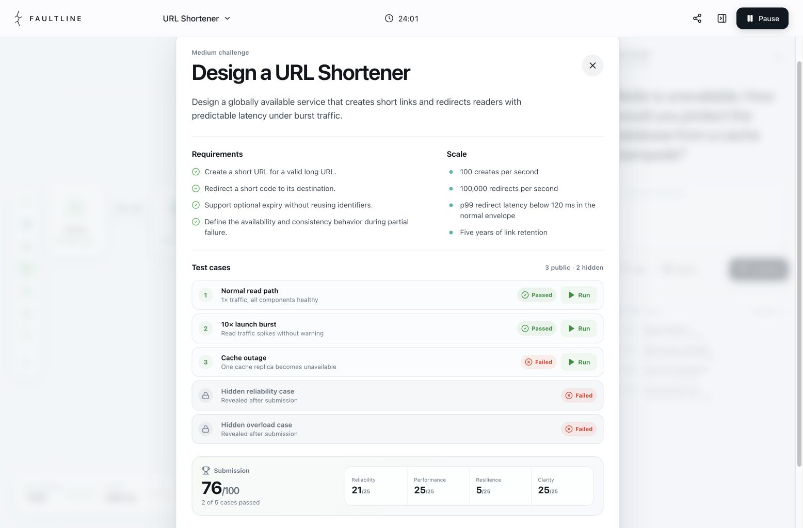
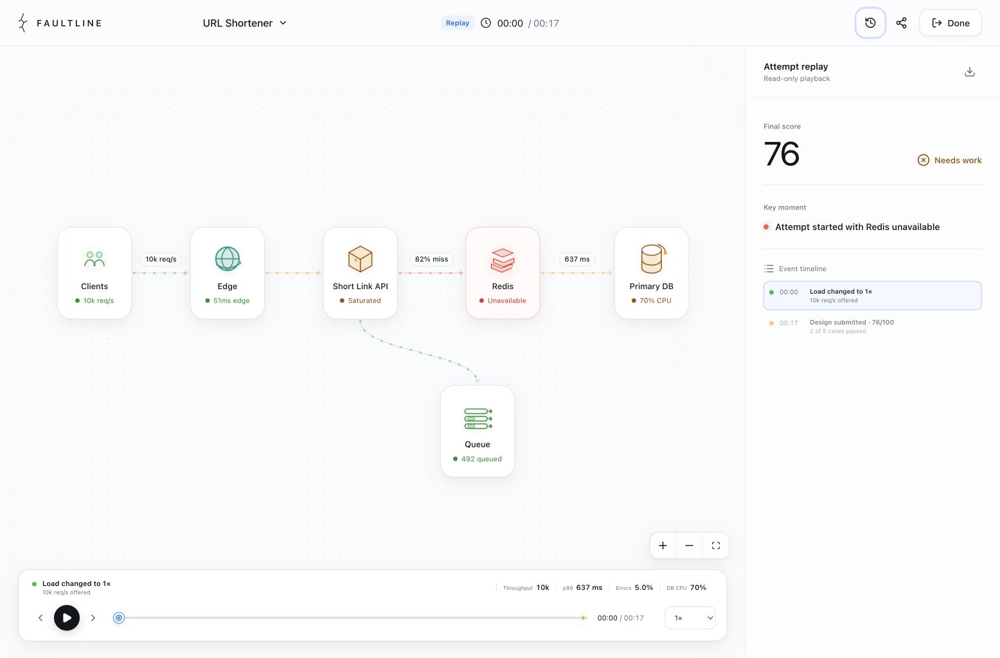
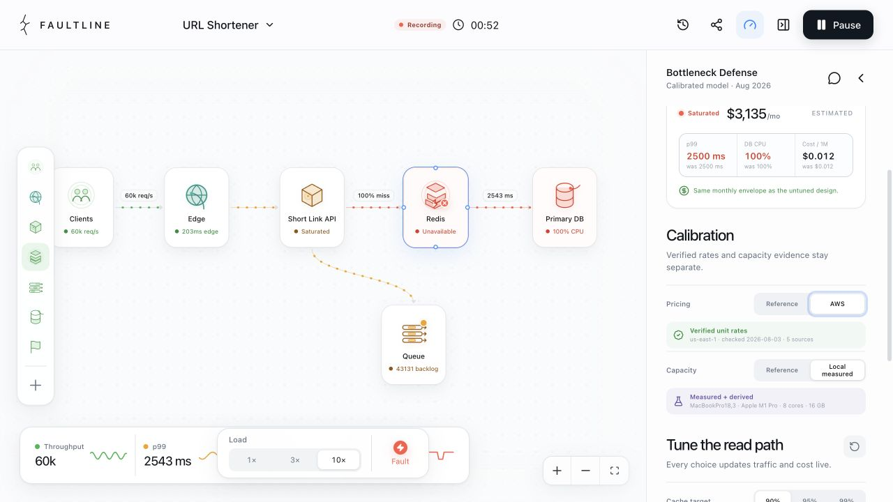

# Faultline

[](https://github.com/Leshabeats/faultline/actions/workflows/ci.yml)
[](https://github.com/Leshabeats/faultline/actions/workflows/deploy-pages.yml)
[](LICENSE)

**[Try the live demo](https://leshabeats.github.io/faultline/)**



Faultline is a LeetCode-style practice environment for system design. Open a challenge, draw an architecture as the submission, run traffic and failure cases against it, and explain the trade-offs while an interviewer reacts to the live state.

The current release has two coherent challenge packs: a calibrated URL Shortener and **The Celebrity Problem**, a News Feed fan-out exercise built around a 50-million-follower spike.

## Practice loop

1. Read the challenge and capacity requirements.
2. Predict the first bottleneck and commit the reasoning before seeing the model.
3. Build a topology, tune the read or fan-out path, and watch latency, freshness, saturation, and estimated cost move together.
4. Take an exact component replica or connection offline, inspect the animated blast radius, then recover it.
5. Defend the trade-off when the interviewer challenges the assumptions.
6. Submit against the complete deterministic judge, including redacted hidden cases.
7. Replay the exact architecture, capacity choices, targeted fault, reasoning, and submission sequence.
8. Publish a redacted Shareable Run and open the public link in a clean browser session.

The launch topology scores `76/100`. Connecting a complete second cache path makes the cache-outage case pass and raises the score to `83/100`; dropping an unconnected box onto the canvas changes nothing.





## What works today

- Interactive system canvas with draggable, connectable components built on React Flow.
- Click-through component inspector with the Short Link API endpoints, Redis cache keys, database schema, responsibilities, and design decisions.
- Topology controls on the diagram: replicas and shards are visible on each node and change capacity, availability, database cost, and replay state.
- Failure Director: take one replica or a complete component offline, partition an exact connection, and restore it from the canvas.
- Graph-derived blast-radius animation with a real causal path, isolated components, alternate-route handling, and live metric impact.
- Russian and English product UI with browser-aware defaults and a persistent language switcher.
- A URL Shortener challenge statement with requirements, scale, three public cases, and two redacted hidden cases.
- The Celebrity Problem: a News Feed challenge with normal traffic, a 50M-follower spike, worker outage, hot-key, and duplicate-delivery cases.
- A reusable challenge-pack registry that switches the seed graph, fault controls, telemetry language, tuning surface, judge, and replay presentation together.
- A deterministic local judge: submit the current topology, see per-case pass/fail, a 0–100 score, four-dimension breakdown, then improve the diagram and run again.
- Stateful, animated icons for clients, gateways, services, caches, queues, databases, and regions.
- Live traffic animation and telemetry for throughput, p99 latency, errors, database CPU, cache misses, and queue depth.
- Bottleneck Defense: prediction-before-feedback, cache/index/pool/replica/database tuning, and a live baseline comparison.
- Celebrity Defense: predict the first fan-out limit, then compare write/read/hybrid fan-out, worker count, batching, celebrity thresholds, and idempotent delivery.
- A versioned estimated cost model with monthly cost, cost per million redirects, workload math, storage footprint, and disclosed assumptions.
- Separate calibration controls for verified AWS `us-east-1` unit rates and capacity evidence, so a provider price is never presented as measured throughput.
- A reproducible local benchmark pack with real `pgbench` and `redis-benchmark` results, plus strict validation for the public pack format.
- Deterministic target-load controls (`1x`, `3x`, `10x`) with a 2.8-second animated user ramp and challenge-specific fault injection menus.
- A local interviewer with follow-up questions, hints, design review, and answer feedback informed by the current diagram and simulation metrics.
- Semantic attempt recording for load, exact node/edge fault target, topology, capacity tuning, interviewer-answer, and submission actions without storing derived animation noise.
- Local attempt history with deterministic play/pause, scrub, previous/next event controls, `0.5x`/`1x`/`2x` speed, and synchronized metrics.
- Versioned public replay export/import, strict validation, safe local-storage retention, and migration from the v0.1 scenario snapshot.
- Shareable Run: publish a redacted attempt to the local Go API, copy a public URL, and replay it read-only without sign-in.
- Interview timer, pause/run control, event history, full component creation, and responsive desktop/mobile layouts.
- Unit coverage for simulation behavior, targeted-fault graph impact, topology reachability, judge scoring/redaction, provider routing, replay reduction, serialization, migration, and persistence.

## Run locally

Requires a recent Node.js release, npm, and Go 1.22+ if you want public share links.

```bash
npm install
npm run dev -- --host 127.0.0.1 --port 4173
```

Open <http://127.0.0.1:4173>. History, local export/import, and replay work without a backend.

To publish a Shareable Run:

```bash
# terminal 1
npm run dev:api

# terminal 2
npm run dev -- --host 127.0.0.1 --port 4173
```

The Vite dev server proxies `/api` and `/healthz` to `http://127.0.0.1:8787`. Example environment files live at [`.env.example`](.env.example) and [`backend/.env.example`](backend/.env.example). SQLite data stays in `backend/data/` and is gitignored.

Other commands:

```bash
npm run test:run  # run frontend tests once
npm test          # run Vitest in watch mode
npm run build     # type-check and create the production bundle
npm run preview   # serve the production bundle locally
npm run test:api  # run Go tests
```

## Simulation truth and interview providers

The simulation engine is the source of truth. Given the same workload, capacity choices, topology, fault, and tick, it computes the same state, node health, metrics, and estimate. An interview provider may interpret that state, ask a question, or critique an answer; it must not invent or overwrite simulation results.

Failure Director derives reachability, surviving replicas, alternate routes, isolated components, and causal paths from the actual graph. Its latency, error, throughput, and queue penalties are deterministic teaching estimates layered onto the calibrated capacity model; they are not production measurements.

Cost is intentionally labeled `Estimated`. The default price pack uses checked AWS `us-east-1` on-demand rates for Fargate, Application Load Balancer, ElastiCache for Valkey, SQS, RDS for PostgreSQL, and gp3. The rates are verified; traffic shape, provisioned quantities, retention, replicas, and excluded services remain modeled, so the result is an architecture subtotal rather than a cloud bill forecast.

Capacity evidence is a separate axis. The default `reference-2026.08` capacity pack is transparent but estimated. The optional local M1 Pro pack contains measured `pgbench` and `redis-benchmark` baselines, while its unmeasured service capacity and 8/16 vCPU extrapolations remain explicitly marked `estimated` or `derived`. It is useful for learning how calibration changes a conclusion; it is not an AWS benchmark.

See [Calibration packs](docs/CALIBRATION.md) for exact SKU rates, formulas, benchmark commands, provenance, exclusions, and the fail-closed pack contract.



The current `LocalInterviewProvider` is a deterministic, offline preview. `InterviewRouter` keeps the UI independent from the provider, so a future OpenAI-compatible or Perplexity-backed implementation can be registered without changing callers.

The local judge runs every case at a fixed simulation tick and only counts capacity that belongs to a complete client-to-database path. Hidden result objects expose only an ordinal and pass/fail. Because this is an offline browser release, the hidden inputs still ship in the client bundle; the hosted version should execute them in the Go service before treating them as secret or cheat-resistant.

Keep vendor credentials on a server. A browser-side adapter should call only your own backend:

```ts
import { interviewRouter } from './src/interview/router'
import type {
  InterviewProvider,
  InterviewRequest,
  InterviewResponse,
} from './src/interview/types'

class RemoteInterviewProvider implements InterviewProvider {
  id = 'remote'
  label = 'AI interviewer'

  async respond(request: InterviewRequest): Promise<InterviewResponse> {
    const response = await fetch('/api/interview', {
      method: 'POST',
      headers: { 'content-type': 'application/json' },
      body: JSON.stringify(request),
    })

    if (!response.ok) throw new Error('Interview provider failed')
    return response.json() as Promise<InterviewResponse>
  }
}

interviewRouter.register(new RemoteInterviewProvider())
```

The first Go service is now in `backend/`: Chi + SQLite, versioned public-replay storage, hashed delete tokens, request-size limits, and basic rate limiting. It stores an immutable public envelope and does **not** re-run the judge. Hidden-case secrecy, signed scores, and PostgreSQL remain later work. `/api/interview` can still grow later into an OpenAI-compatible or Perplexity adapter; keep provider credentials on the server.

## Privacy

This release makes no AI or analytics API calls. Completed attempts stay in this browser's local storage so History survives a reload. Export and Publish both redact interviewer answers, prompts, and feedback by default. No API key is required. Public share links are immutable snapshots of that redacted envelope; a delete token is shown once and stored only in the publishing browser. When a remote provider is added, proxy it through a backend and never place secrets in Vite environment variables or client bundles.

## Contributing

Read [CONTRIBUTING.md](CONTRIBUTING.md) before opening a pull request. Product direction lives in [ROADMAP.md](ROADMAP.md), security reports follow [SECURITY.md](SECURITY.md), and all participation is covered by the [Code of Conduct](CODE_OF_CONDUCT.md).

## Project structure

```text
src/
  challenges/    Challenge manifests, requirements, cases, and rubrics
  canvas/        React Flow nodes, edges, types, and launch scenario
  capacity/      URL-shortener workload, bottleneck, calibration packs, and cost model
  components/    Product chrome, controls, telemetry, and animated icons
  domain/        Shared system-design and simulation contracts
  interview/     Provider interface, router, local interviewer, and tests
  judge/         Deterministic public/hidden suite, redaction, scoring, and tests
  newsFeed/      Celebrity workload, fan-out, freshness, backlog, and cost model
  publicReplay/  Public envelope, publish client, capability store, and hash routing
  replay/        Versioned semantic log, reducer, import/export, repository, and tests
  simulation/    Deterministic engine, topology analysis, and tests
  App.tsx        Canvas orchestration and end-to-end interaction state
  styles.css     Responsive visual and motion system
backend/
  cmd/faultline  Chi HTTP server, graceful shutdown, and SQLite bootstrap
```
